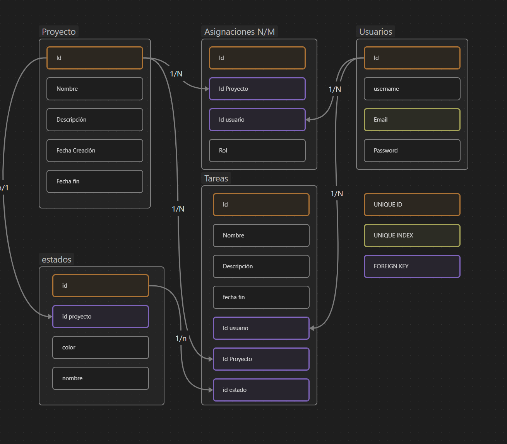

<!-- backgroundColor: #202228 -->
<!-- color: #ffffff -->

# <!--fit--> VARBAS
Sergio Fernández

---
<!-- paginate: true -->

# ¿Qué es VARBAS?

Varbas es una aplicación web que ayuda a equipos de trabajo a gestionar proyectos y tareas de manera efectiva y eficiente. La aplicación está diseñada para permitir a los equipos crear, asignar, rastrear y completar tareas de manera organizada y colaborativa.

---
<!-- _class: lead -->

  # <!--fit-->  Tecnologías

  - **Frontend**: Next.js, React, Tailwind CSS
  - **Backend**: Prisma, Node.js, TypeScript
  - **Base de datos**: MySQL
  - **Hosting y despliegue**: Vercel

---

## Frontend

En el desarrollo de Varbas se han utilizado las siguientes tecnologías frontend:

- **Next.js**: Framework de React para crear aplicaciones web con alto rendimiento y escalabilidad.
- **React**: Biblioteca de JavaScript para construir interfaces de usuario.
- **Tailwind CSS**: Framework de CSS para construir rápidamente interfaces de usuario personalizadas y receptivas.

---
## Backend

### API

- **Prisma**: ORM para bases de datos que permite interactuar con la base de datos de manera segura y eficiente.
- **Node.js**: Plataforma de desarrollo para construir aplicaciones web escalables y robustas.
- **TypeScript**: Lenguaje de programación que añade características de tipado estático al JavaScript, para mejorar la calidad del código y reducir errores.

### Base de datos

- **MySQL**: Sistema de gestión de bases de datos relacional de código abierto.

---

---

## Hosting y despliegue

En el desarrollo de Varbas se ha utilizado la siguiente tecnología para el hosting y despliegue de la aplicación:

- **Vercel**: Plataforma de hosting y despliegue de aplicaciones web que permite un despliegue rápido y sencillo de la aplicación.

---

# Características principales de Varbas

Permite crear, organizar y rastrear tareas de manera efectiva.

Posibilidad de asignar tareas a diferentes miembros del equipo.

Establecer fechas límite y hacer seguimiento del progreso en tiempo real.

